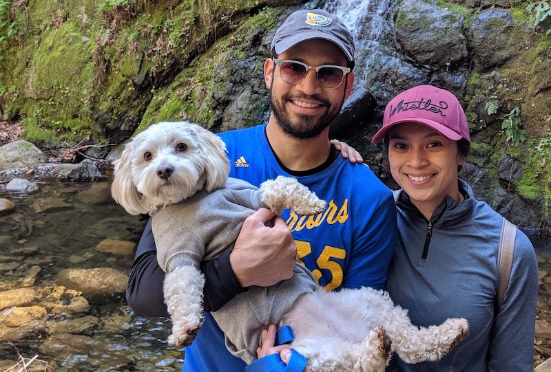
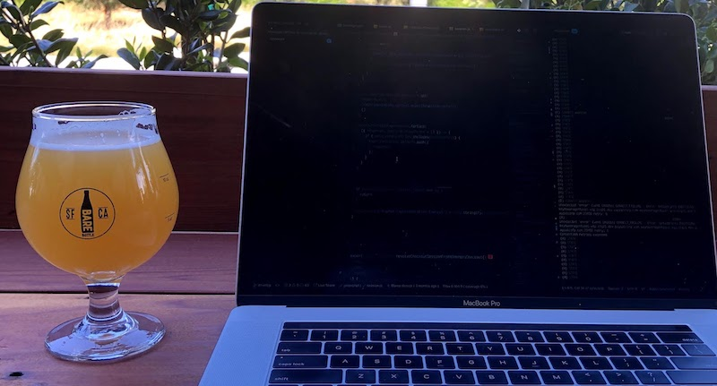
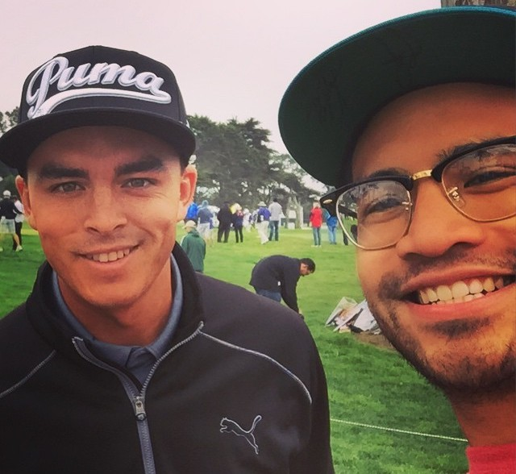

import Heading from '../components/Heading';

<Heading />

I'm a software engineer from the Bay Area 🌉

I studied computer engineering at Cal Poly SLO and fell in love with web
development after taking a software engineering tech elect class. Although
building robots are fun 🤖 I've always been passionate about crafting enjoyable
user experiences.

After I graduated, I started my journey at PayPal and became fascinated with the
payments space and enabling commerce all over the globe. Now I use web
technologies to build exceptional experiences 👨‍💻

I focus mainly on React, React Native, Gatsby, GraphQL, Node, Express, and I'm
expanding my TypeScript knowledge.

## 👨‍💻 [**See the things I've been working on**](/projects)

---

## More about me

I love my wife 💁 and my dog 🐶

I love a delicious beer 🍺 or a whiskey neat 🥃

I love golf ⛳ and music 🥁 (I can play the drums)

