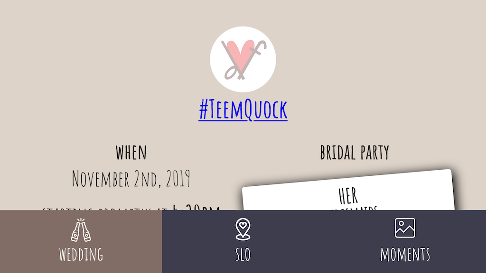

import SEO from '../components/seo';

<SEO
  title="Projects"
  description="Some projects that I've been working on"
  keywords={['dereck', 'dereck quock', 'projects', 'work']}
/>

# 👨‍💻 Projects

## Personal

### ❤️ [Harana Events](https://www.haranaevents.com/)

<svg style={{ maxWidth: '10rem' }} x="0" y="0" viewBox="187 70 200 120">
  <g>
    <path
      fill="none"
      stroke="#AD8B19"
      strokeWidth="4"
      strokeMiterlimit="10"
      d="M266.41,149.76c-9.57,6.51-17.16,10.42-17.2,10.4c-3.29-1.73-55.83-29.82-55.83-60.24
c0-5.29,2.57-26.74,23.49-26.74c19.49,0,30.88,22.14,32.34,25.16c0,0,11.42-25.16,32.34-25.16c13.78,0,19.6,9.31,21.96,17.17"
    ></path>
    <path
      fill="none"
      stroke="#AD8B19"
      strokeWidth="4"
      strokeMiterlimit="10"
      d="M326.79,186.28c-3.29-1.73-55.83-29.82-55.83-60.24c0-5.29,2.57-26.74,23.49-26.74
c19.49,0,30.88,22.14,32.34,25.16c0,0,11.42-25.16,32.34-25.16s23.49,21.46,23.49,26.74
C382.62,157.45,326.89,186.34,326.79,186.28z"
    ></path>
  </g>
</svg>

My wife and a couple of her friends really enjoy event planning and they've experienced how much goes into wedding
coordination and planning, so they decided to give it a try. I helped them out and built them a website so they can
market to couples and try to acquire clients.

#### Tech

- [Next.js](https://nextjs.org/)
- [tailwindcss](https://tailwindcss.com/)
- [Notion API](https://developers.notion.com/) for blog posts

---

### 🏈 [Fantasy Football Helper](https://keepers.vercel.app/)

I needed a way to help my fantasy football league know what keepers they can select for the next season. Keepers are
players on a fantasy manager's roster that they can keep for another year. Our league has custom rules for keeping
players, so it was easier for me to just build it myself using [Sleeper's API](https://docs.sleeper.app/).

I also used the API to get roster scores and calculate the highest scoring roster and the highest scoring bench for each
week. We pay out bonuses for these highest scores, so I wanted an easy way to be able to know which manager to pay. I
also supported putting in the league ID and getting those leagues' scores. This way my wife, who also plays, can pay
out her league as well.

#### Tech

- [Next.js](https://nextjs.org/)
- [Sleeper.app API](https://docs.sleeper.app/)
- [React Query](https://react-query.tanstack.com/) for data fetching

---

### 💍 [Wedding Website](https://github.com/dereckquock/derteems)



Wedding website built for mobile with Gatsby that showed wedding information, displayed our engagement photos and
allowed guests to RSVP.

#### Tech

- Gatsby - [gatsby-source-google-sheets](https://www.gatsbyjs.org/packages/gatsby-source-google-sheets/)
  to use Google Sheets as a database for RSVP data
- [Reach UI](https://reacttraining.com/reach-ui/) - [Netlify Forms](https://docs.netlify.com/forms/setup/) for RSVP
  submissions

  Handling RSVP submissions was fairly difficult because of the variable amount of people that could RSVP for a certain
  group. For example, some of our friends are single and didn't have a plus-one and some of our family members had kids
  that were also attending.

  I had to fetch the people that were associated with the person that was RSVPing and based on the form input, I would
  reduce the data down into an object that tells me if a specific person was going to attend and their protein
  preference:

  ```javascript
  function getRsvpData(data) {
    return data.reduce((formData, { guest, isGoing, protein }) => {
      return {
        ...formData,
        [`${guest} Is Going`]: isGoing,
        [`${guest} Protein`]: protein,
      };
    }, {});
  }
  ```

  I wish that [Netlify Functions](https://docs.netlify.com/functions/overview/) were available at the time because I
  would have definitely used that 😅

- [React Context]() for having a fun dark mode

  [Kent's post about how to use React Context
  effectively](https://kentcdodds.com/blog/how-to-use-react-context-effectively)
  really helped me execute this easily 🔥

---

## Echo.Church

### 📱 [Echo App](https://github.com/echo-labs-team/the-resonance-project)


App is built with React Native and allows people to be able to interact with the Church.

#### Tech

- [React Native](https://reactnative.dev/)
- [Expo](https://expo.io/)
- [React Navigation](https://reactnavigation.org/)
- [react-native-reanimated](https://github.com/software-mansion/react-native-reanimated) & [react-native-redash](https://github.com/wcandillon/react-native-redash)
- [Formik](https://jaredpalmer.com/formik/)
- [React Native Storybook](https://storybook.js.org/docs/guides/guide-react-native/)

---

## Hackathons

### 📱 React Native app that enables automatic expense reporting

This was a hacked version of the PayPal app that allows a user to automatically create an expense report from a
transaction.

#### Tech

- React Native
- OCR using python (teammate built this) to parse an uploaded receipt
- [wit.ai](https://wit.ai/) for using NLP to categorize items on the receipt

### 🧾 Invoicing app that uses image processing to prefill invoice data

App that used an item image to prefill the form used to create an invoice. After filling out the invoice data, the
seller is presented with different outputs for sending an invoice: email the invoice, share an invoice link, scan a QR
code, or share in Facebook Messenger. This allowed the seller to create and send the invoice in whatever specific
context that they were in, creating less friction when selling something.

#### Tech

- React
- [Google Cloud Vision API](https://cloud.google.com/vision) to process an item image
