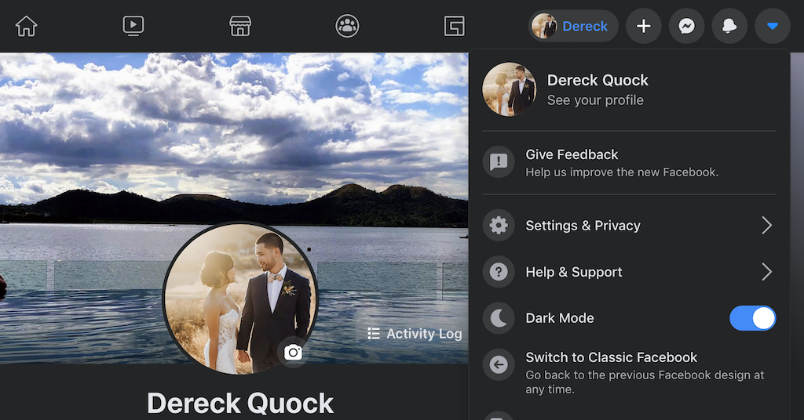
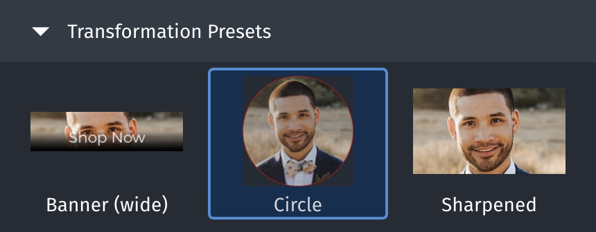

Since _Avatar: The Last Airbender_ is releasing on Netflix, I thought that this made a lot of sense 😂


I'm super excited to rewatch all of _The Last Airbender_ and I also can't contain my excitement for sharing some
GraphQL knowledge 😬

Avatar images are commonly used for apps that have users and there are many places within an app where an avatar image
is displayed. Take my Facebook profile page for example:



My profile avatar image is shown in three different sizes in three different areas. Facebook loads each of these areas
at different times and each image is a separate requested image from their CDN based on the necessary size.

Most websites would just load the large 3x or 2x image and scale it down as needed by setting its size using CSS. But
what if the user never navigates to a page where the large avatar image is shown? Then we're making a request for a
large image unnecessarily. [GraphQL](https://graphql.org/) is perfect for this use case because we can ask for the exact
avatar image that we need. I'll show you how you to set up a GraphQL server using [Apollo
Server](https://www.apollographql.com/docs/apollo-server/) and query for specific images from
[Cloudinary](https://cloudinary.com/), which helps us manage and deliver optimized images to our client app.

## Setting up [Cloudinary](https://cloudinary.com/) to manage our avatar image

Sign up and upload an avatar image to your Media Library. After you have your avatar image, you can explore the
different transformations that can be done by checking out the presets.



For our avatar image, we need to [transform the media asset using dynamic
URLs](https://cloudinary.com/documentation/image_transformations#transforming_media_assets_using_dynamic_urls).

The Cloudinary asset delivery URL uses this structure 👇

`https://res.cloudinary.com/<cloud_name>/<resource_type>/<type>/<transformations>/<version>/<public_id>.<format>`

You can learn more about the different image transformations that are possible from the [image transformation
reference](https://cloudinary.com/documentation/image_transformation_reference). But for our avatar image, we only care
about making it a circle and getting the exact image size that we query for.

To make the image a circle, we just need to set its radius to max: `r_max`. And to specify the size of the image, we
just need to set its width: `w_<size>`.

Cloudinary already performs [default
optimizations](https://cloudinary.com/documentation/image_optimization#default_optimizations) whenever transformations
are applied. Depending on the situation, we can always manually adjust the [quality
parameter](https://cloudinary.com/documentation/image_transformations#adjusting_image_quality) ourselves.

Here's an example of how our constructed Cloudinary URL will look like for the avatar image:

```text
https://res.cloudinary.com/dereckquock/image/upload/r_max,w_96/avatar.jpg
```

## Setting up an [Apollo Server](https://www.apollographql.com/docs/apollo-server/)

> 🚀 You can fork [this Apollo Server CodeSandbox template](https://codesandbox.io/s/apollo-server-apollo-server) to get
> up and running quickly.

> 🍹 If you need a refresher on GraphQL, check out the [GraphQL docs](https://graphql.org/learn/), [go through tutorials
> with How To GraphQL](https://www.howtographql.com/), or learn with the [Apollo
> platform](https://www.apollographql.com/docs/intro/platform).

### [Define our schema](https://www.apollographql.com/docs/apollo-server/schema/schema/)

We provide input to our `avatar` query so we can specify the size and type of image that we want. To do this, we create
an [input type](https://www.apollographql.com/docs/apollo-server/schema/schema/#input-types) that defines the input
fields that we're expecting. Our `AvatarImageInput` accepts a `size` and a `type`, which is our corresponding enum types
`SquareImageSize` and `ImageType`. And we define our return type of `Avatar`, which gives us the image URL and its size.

```graphql
"Defined square image sizes that are used for avatar images"
enum SquareImageSize {
  "Small 96x96 px"
  S

  "Medium 200x200 px"
  M

  "Large 300x300 px"
  L
}

"Supported image types"
enum ImageType {
  jpg
  png
  gif
}

"Input for the avatar image"
input AvatarImageInput {
  "The square image sizes"
  size: SquareImageSize

  "The image type"
  type: ImageType
}

"Avatar image containing the Cloudinary URL and the size of the image in px"
type Avatar {
  "Avatar Cloudinary image URL"
  url: String

  "Size of the image"
  size: Int
}

type Query {
  """
  Query for the avatar image
  @param {AvatarImageInput} image - the size of the image and type of image (jpg, png, gif)
  """
  avatar(image: AvatarImageInput = { size: S, type: jpg }): Avatar
}
```

Now that we have our schema, we need to take in the query input and construct the correct Cloudinary image URL. But to
return the correct data for our query, we need to define a resolver.

### [Define our resolver](https://www.apollographql.com/docs/apollo-server/data/resolvers/)

From the Apollo Docs:

> **A resolver is a function that's responsible for populating the data for a single field in your schema.**
>
> It can populate that data in any way you define, such as by fetching data from a back-end database or a third-party API.

We take our query input arguments, `size` and `type`, and construct the Cloudinary URL for the exact avatar image that
we want. The only transformation parameter that we need to worry about is the width, so we can use a utility function
`getImageSize()` to get the size in pixels.

```js
/**
 * Get the image size based on S, M, L
 */
function getImageSize(size) {
  switch (size) {
    case 'S':
      return 96;
    case 'M':
      return 200;
    case 'L':
      return 300;
    default:
      return 96;
  }
}

const resolvers = {
  Query: {
    // Learn more about these resolver arguments:
    // https://www.apollographql.com/docs/apollo-server/data/resolvers/#resolver-arguments
    avatar: (root, args) => {
      // Destructure the size and type out of the image input
      const { image: { size = 'S', type = 'jpg' } = {} } = args;

      // Base Cloudinary URL
      const baseUrl = 'https://res.cloudinary.com/dereckquock/image/upload/';

      // Get the image size in px based on our query input: `size enum`
      const imageSize = getImageSize(size);

      // The transformations that we need for the avatar image
      const transformations = `r_max,w_${imageSize}`;

      // Construct the URL with necessary transformations
      const url = `${baseUrl}${transformations}/avatar.${type}`;

      // Return the data for our `Avatar` type
      return {
        url,
        size: imageSize,
      };
    },
  },
};
```

The returned object for our avatar query is in the shape:

```js
return {
  url,
  size: imageSize,
};
```

This is exactly the shape of the `Avatar` type that we've defined above. Now that we have our schema and its resolver
defined, we can execute our query for an avatar image.

Check out this CodeSandbox to see this entire example 👇

[](https://codesandbox.io/s/graphql-query-for-an-avatar-image-vnwr4?fontsize=14&hidenavigation=1&theme=dark)

### Executing our query

The simplest query we can make is to just get the avatar image without any input. Since we have default parameters, the
default avatar image will be a small jpg image.

#### Query

```graphql
{
  avatar {
    url
    size
  }
}
```

#### Response

```json
{
  "data": {
    "avatar": {
      "url": "https://res.cloudinary.com/dereckquock/image/upload/r_max,w_96/avatar.jpg",
      "size": 96
    }
  }
}
```

If we want to get three avatar images as we saw for my Facebook profile, we just need to use [query
aliases](https://graphql.org/learn/queries/#aliases) to get a **small**, **medium**, and **large** image.

#### Query

```graphql 2,6,10
query Avatar {
  small: avatar(image: { size: S, type: jpg }) {
    url
    size
  }
  medium: avatar(image: { size: M, type: jpg }) {
    url
    size
  }
  large: avatar(image: { size: L, type: jpg }) {
    url
    size
  }
}
```

#### Response

```json 3,7,11
{
  "data": {
    "small": {
      "url": "https://res.cloudinary.com/dereckquock/image/upload/r_max,w_96/avatar.jpg",
      "size": 96
    },
    "medium": {
      "url": "https://res.cloudinary.com/dereckquock/image/upload/r_max,w_200/avatar.jpg",
      "size": 200
    },
    "large": {
      "url": "https://res.cloudinary.com/dereckquock/image/upload/r_max,w_300/avatar.jpg",
      "size": 300
    }
  }
}
```

We would only execute this query if we want all three sizes of the avatar image. GraphQL allows us to describe the data
that the client needs, no more, no less.

Try executing the query for yourself 👇

[](https://codesandbox.io/s/graphql-query-for-an-avatar-image-vnwr4?fontsize=14&hidenavigation=1&theme=dark)

## Conclusion

We've learned how to leverage GraphQL and Cloudinary to query for avatar images for multiple sizes by taking in query
input and constructing the Cloudinary image URL with transformations. GraphQL enables us to only request the data that
the client needs, so we don't over-fetch data or fetch an unnecessarily large image. These optimizations help apps to
become faster and lighter for users. 🔥


