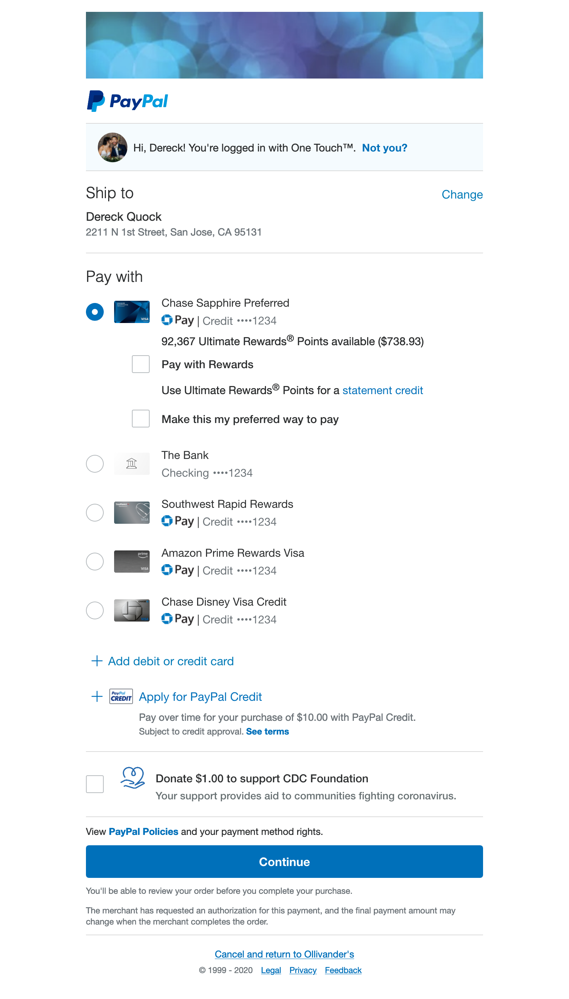

import StickyButton from './sticky-button';
import StickyHeaders from './sticky-headers.js';
import StickyTable from './sticky-table.js';

## Creating a sticky experience

🛒 I'm on the Checkout web team at PayPal and we're working on the next generation of our checkout experience. The
review page can be fairly content-heavy if the customer is eligible for the many features that we display on our
single-page app.

This is how a checkout review page looks for my account:



As you can see, there's a lot on the page. And this isn't even including other features like currency conversion,
applying for PayPal Credit, or if I have some PayPal balance and want to apply that to the transaction.

The **Continue** button to continue checking out is all the way at the bottom. And if the customer is checking out in a
smaller viewport on their phone, they'd have to scroll all the way down to continue. Adding any friction during a
checkout experience is asking for lower conversion. Enter `position: sticky`.


Not only is [sticky positioning](https://developer.mozilla.org/en-US/docs/Web/CSS/position#Sticky_positioning) great for
headings in a list, but it's the perfect use case for our **Continue** button.

<StickyButton />

[](https://codesandbox.io/s/sticky-positioning-v7x6j?fontsize=14&hidenavigation=1&theme=dark)

Notice how the button stays stuck to the bottom until more content under it pushes is up 🔥 and all we had to do was add
some CSS:

```css
.sticky {
  position: sticky;
  bottom: 0;
}
```

> This will be ignored in browsers that don't have support (💩 IE) and will
> behave like `position: relative`

Now the customer doesn't necessarily _need_ to scroll all the way down if they want to check out quickly. By making our
**Continue** button easily accessible, our users that don't need to change their default shipping options or funding option
were able to check out without any friction. This is the sticky experience that we're looking for! 🕸

## Let's explore other uses for sticky positioning

### Sticky headings

[The example from the MDN docs](https://developer.mozilla.org/en-US/docs/Web/CSS/position#Sticky_positioning) shows the
common use for sticky headings of a list. This is a pattern that's used for lists in native apps, and this is easy to
do in web apps as well.

<StickyHeaders />

[](https://codesandbox.io/s/sticky-headings-ii910?fontsize=14&hidenavigation=1&theme=dark)

Just as we set `bottom: 0` to make our **Continue** button stick to the bottom, setting `top: 0` on a sticky
positioned heading causes it to stick to the top.

Here we have some styled components:

```css 3,4
const Dt = styled.dt`
  padding: 6px 16px;
  position: sticky;
  top: 0;
  background: #666666;
  color: white;

  /* don't have a border for the first item in the section */
  + dd {
    border-top: 0;
  }
`;
const Dd = styled.dd`
  margin: 0 0 0 16px;
  padding: 10px 0;
  border-top: 1px solid #ccc;
`;
```

and the corresponding markup:

```jsx
<Dt>A</Dt>
<Dd>Aunt May</Dd>
<Dt>B</Dt>
<Dd>Black Cat</Dd>
```

If you want to explore more of how to create awesome sticky headers, Eric Bidelman has an awesome post about [using an
`IntersectionObserver` to observe when sticky positioned elements become stuck](https://developers.google.com/web/updates/2017/09/sticky-headers).

### Sticky header rows and columns of a table

Suppose you want to show a table of information, such as a schedule. You could have the table headers be stuck, but also
have a sticky column with the times of the day.

<StickyTable />

[](https://codesandbox.io/s/sticky-table-em77t?fontsize=14&hidenavigation=1&theme=dark)

By setting `top: 0` for the column headers and `left: 0`, we can get the table headers to stick correctly.

To make the table headers stick, we just have to do something like this:

```css 3,9,12
const TableHeader = styled.th`
  padding: 20px;
  position: sticky;
  background: #666666;
  color: white;
  text-align: center;

  &[scope='col'] {
    top: 0;
  }
  &[scope='row'] {
    left: 0;
  }
`;
```

with a table defined like this:

```jsx
<tr>
  <TableHeader scope="row"></TableHeader>
  <TableHeader scope="col">Wednesday</TableHeader>
  <TableHeader scope="col">Thursday</TableHeader>
  <TableHeader scope="col">Friday</TableHeader>
  <TableHeader scope="col">Saturday</TableHeader>
  <TableHeader scope="col">Sunday</TableHeader>
</tr>
<tr>
  <TableHeader scope="row">8:00 AM</TableHeader>
  <TableCell>Wake up</TableCell>
  <TableCell>Wake up</TableCell>
  <TableCell>Wake up</TableCell>
  <TableCell>Sleep</TableCell>
  <TableCell>Sleep</TableCell>
</tr>
```

Now get out there and create some sticky experiences!


